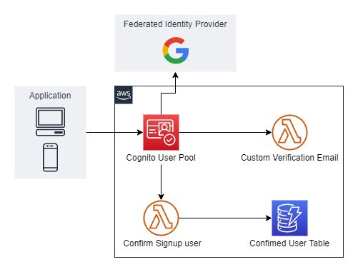

# Infrastructure as Code with AWS Cognito, Federated Identity, and Serverless
Cognito Authentication System with Federated Identity in Serverless Framework(IaC)

## Architecture

Let me explain which AWS service is used for which purposes in the above architecture.
- **Cognito User Pool:** It is used to authenticate users, in which you can also authenticate users via Google.
- **Custom Verification Email Function:** This lambda function will call, when user sign-up or create a new account and the content of this function will be OTP.
- **Confirm Signup User Function:** It will call, when user successfully created and verified account and it will store user data in database.
- **Confirmed User Table:** It is used to store data of confirmed users.

> **_Note:_**
In this project, we will use Serverless Framework to reserve our resources on AWS as I have explained above, so if you are having any question regarding any properties in template file then just search like `cloudformation <service-name>` and refer the cloudformation documentation for those services.

---
### For the `Pre-requisites`, `Implementation` and `Clean` visit the below my blog post:

https://enlear.academy/infrastructure-as-code-with-aws-cognito-federated-identity-and-serverless-edf33b347657